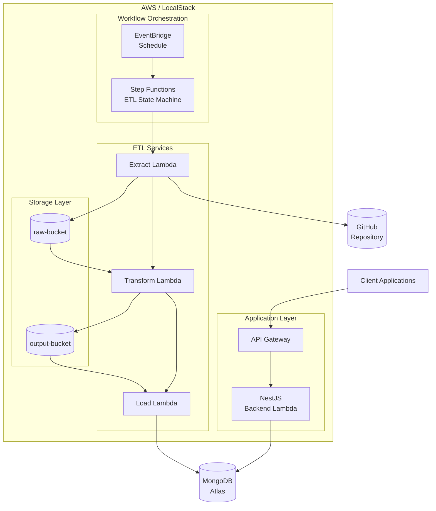
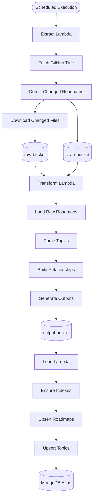
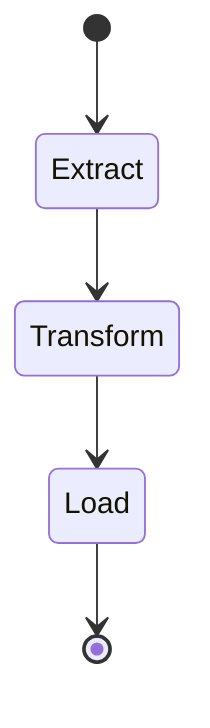

# Roadmaps Platform

A serverless platform for synchronizing, transforming, and serving developer roadmap data.

The system continuously extracts roadmap definitions from GitHub, transforms them into a normalized domain model, loads them into MongoDB Atlas, and exposes the resulting data through a NestJS API deployed as a Lambda function.

The project is developed locally using LocalStack while remaining fully compatible with AWS deployment.

---

# Architecture Overview



---

# System Components

## NestJS Backend

The API layer is implemented as a NestJS application deployed as a Lambda function.

Responsibilities:

* Expose REST APIs
* Serve roadmap data
* Query MongoDB Atlas
* Provide application-facing endpoints

### Runtime

```text
API Gateway
     ↓
NestJS Lambda
     ↓
MongoDB Atlas
```

---

## ETL Pipeline

The ETL pipeline is responsible for synchronizing roadmap definitions from GitHub and maintaining the MongoDB dataset used by the API.

The workflow is orchestrated by AWS Step Functions.

### Stages

```text
Extract
   ↓
Transform
   ↓
Load
```

---

# ETL Workflow



---

# State Machine

The ETL process is orchestrated using AWS Step Functions.



Current retry strategy:

```yaml
Retry:
  ErrorEquals:
    - States.ALL
  IntervalSeconds: 10
  MaxAttempts: 2
  BackoffRate: 2
```

---

# Extract Service

The Extract service synchronizes roadmap content from GitHub.

## Responsibilities

* Fetch repository tree
* Discover eligible roadmaps
* Detect roadmap changes using fingerprints
* Download changed roadmap assets
* Persist synchronization state

## Inputs

```text
GitHub Repository
```

## Outputs

```text
state-bucket
raw-bucket
```

## Stored State

```json
{
  "roadmaps": {
    "backend": {
      "fingerprint": "...",
      "syncedAt": "..."
    }
  }
}
```

## Change Detection

Each roadmap is fingerprinted using:

```text
SHA256(
    file_path + file_sha
)
```

Only changed roadmaps are downloaded.

---

# Transform Service

The Transform service converts raw roadmap assets into a normalized domain model.

## Responsibilities

* Read roadmap definitions
* Parse topic markdown files
* Extract resources
* Build topic relationships
* Generate output artifacts

## Inputs

```text
raw-bucket
state-bucket
```

## Outputs

```text
output-bucket
```

### Generated Files

```text
output/
├── roadmaps.json
└── topics.json
```

---

# Load Service

The Load service persists transformed data into MongoDB Atlas.

## Responsibilities

* Read transformed outputs
* Ensure indexes
* Upsert roadmaps
* Upsert topics

## Collections

### roadmaps

```json
{
  "_id": "...",
  "name": "backend"
}
```

### topics

```json
{
  "topicId": "...",
  "roadmapId": "...",
  "name": "...",
  "resources": [],
  "childTopics": []
}
```

---

# Storage Architecture

## state-bucket

Stores synchronization metadata.

```text
sync/
├── state.json
└── roadmap_ids.json
```

### state.json

Tracks roadmap fingerprints and synchronization timestamps.

### roadmap_ids.json

Provides stable ObjectIds for roadmaps across executions.

---

## raw-bucket

Stores downloaded roadmap assets.

```text
roadmaps/
├── backend/
├── frontend/
├── devops/
└── ...
```

---

## output-bucket

Stores transformed artifacts.

```text
output/
├── roadmaps.json
└── topics.json
```

---

# Scheduling

The ETL pipeline executes automatically every 20 minutes.

```yaml
rate(20 minutes)
```

Execution Flow:

```text
EventBridge
      ↓
Step Functions
      ↓
Extract
      ↓
Transform
      ↓
Load
```

---

# Observability

The platform enables tracing and logging across all services.

## CloudWatch Logs

Dedicated log groups:

```text
NestJS Lambda

Extract Lambda

Transform Lambda

Load Lambda

Step Functions
```

## X-Ray Tracing

Enabled for:

* NestJS Lambda
* Extract Lambda
* Transform Lambda
* Load Lambda
* Step Functions

---

# Local Development

The project is developed using LocalStack.

Supported services:

* Lambda
* API Gateway
* S3
* Step Functions
* EventBridge
* CloudWatch Logs

## Build

```bash
sam build
```

## Deploy

```bash
sam deploy
```

## Local API

```text
http://localhost:4566/_aws/execute-api/{api-id}/Prod/
```

---

# Design Decisions

## Why Step Functions?

The ETL workflow consists of independent stages that require orchestration.

Benefits:

* explicit workflow definition
* execution history
* retries
* tracing
* operational visibility

---

## Why S3 Between Stages?

Instead of passing large payloads through Step Functions:

* Extract writes raw artifacts
* Transform reads raw artifacts and writes normalized outputs
* Load consumes outputs

Benefits:

* stage isolation
* easier debugging
* reduced payload sizes
* artifact persistence

---

## Why MongoDB Atlas?

MongoDB provides:

* flexible document structure
* efficient topic graph storage
* straightforward upserts
* managed cloud deployment

---

# Future Evolution

The current architecture uses workflow orchestration through Step Functions.

A future iteration may evolve into a fully event-driven architecture.

```mermaid
flowchart LR

    GITHUB[(GitHub)]

    EVENT[EventBridge]

    EXQ[SQS Extract Queue]

    TRQ[SQS Transform Queue]

    LDQ[SQS Load Queue]

    EX[Extract Workers]

    TR[Transform Workers]

    LD[Load Workers]

    RAW[(Raw S3)]

    OUT[(Output S3)]

    DB[(MongoDB)]

    GITHUB --> EVENT

    EVENT --> EXQ

    EXQ --> EX

    EX --> RAW

    RAW --> TRQ

    TRQ --> TR

    TR --> OUT

    OUT --> LDQ

    LDQ --> LD

    LD --> DB
```



Benefits:

* independent scaling
* better fault isolation
* parallel processing
* reduced orchestration overhead
* increased throughput

---

# Technology Stack

## Backend

* NestJS
* TypeScript
* AWS Lambda
* API Gateway

## ETL

* Go
* AWS Lambda
* AWS Step Functions

## Storage

* Amazon S3
* MongoDB Atlas

## Infrastructure

* AWS SAM
* LocalStack
* CloudWatch
* X-Ray

## Source Data

* GitHub API
* developer-roadmap repository

---

# Repository Structure

```text
.
├── roadmap/              # NestJS Backend
├── etl/                  # Go ETL Services
├── stateMachine/         # Step Functions Definitions
├── template.yaml         # AWS SAM Template
└── README.md
```
